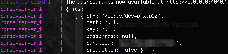

# docker-parse

Based on the work found [here](https://github.com/yongjhih/docker-parse-server), this repo is just a filtered view on how to set up a parse server for testing push notifications, mostly geared towards ios.

## Prerequisites
* Docker


## Before you start the containers

### Add certificates and keys
Either add a .p12 file of certificate and key to a volume that is mounted in the docker-compose by copying your local .p12 file

```
$ cp {your_p12_path} volumes/certs/dev-pfx.p12
```
or, mount certificate and key separately as pems.
```
$ cp {your_cert_path} volumes/certs/dev-pfx-cert.pem
$ cp {your_key_path} volumes/certs/dev-pfx-key.pem

```

### Setup the some environment variables used by the containers
In `silly_config.sh` a smallish set of of variables that are useful when running the containers on your local are defined.
Make a copy of this and change the variables accordingly.

## Start the containers
```
$ docker-compose up
```
Note if you see `dockerparse_mongo-data_1 exited with code 2` in the log no need to worry, that is by design.

To confirm that the parse server is setup with keys for ios, look for a printout of the form


To see that all else is good on your local, you should see the parse dashboard on port `4040`


## Make some calls to setup a user and installation

To steelthread push notifications, one potential setup flow is
* create a user
* login said user
* create a restricted session (for testing purposes)
* create an installation
* link installation with a session (this is for testing, not general flow)

There's a convenience script that does all of this for you:

```
$ python cli.py --mode setup
```
Otherwise, you can curl it away as per the steps below.

### Create a user
```
$ curl -X POST \
  http://localhost:1337/parse/users \
  -H "content-type: application/json" \
  -H "x-parse-application-id: ${APP_ID}" \
  -H "x-parse-rest-api-key: ${REST_API_KEY}" \
  -H "x-parse-revocable-session: 1" \
  -d '{"username":"cooldude6","password":"p_n7!-e8","phone":"415-392-0202"}'
```
### Login
```
$ curl -X GET \
  -H "X-Parse-Application-Id: ${APP_ID}" \
  -H "X-Parse-REST-API-Key: ${REST_API_KEY}" \
  -H "X-Parse-Revocable-Session: 1" \
  -G \
  --data-urlencode 'username=cooldude6' \
  --data-urlencode 'password=p_n7!-e8' \
http://localhost:1337/parse/login
```

### Create a session
```
$ curl -X POST \
  -H "X-Parse-Application-Id: ${APP_ID}" \
  -H "X-Parse-REST-API-Key: ${REST_API_KEY}" \
  -H "X-Parse-Session-Token: r:09d6ba96cd244eeed68ffed31ed42db1" \
  -H "Content-Type: application/json" \
  -d '{"customField":"value"}' \
http://localhost:1337/parse/sessions
```

### Create an installation
```
curl -X POST \
  -H "X-Parse-Application-Id: ${APP_ID}" \
  -H "X-Parse-REST-API-Key: ${REST_API_KEY}" \
  -H "Content-Type: application/json" \
  -d '{
        "deviceType": "ios",
        "deviceToken": ${TOKEN_ID},
        "channels": [
          "general"],
        "installationId": ${INSTALLATION_ID}
      }' \
 http://localhost:1337/parse/installations
```

### Tie a session to an installation
[Documentation](http://docs.parseplatform.org/rest/guide/#creating-sessions)
```
curl -X PUT \
  -H "X-Parse-Application-Id: ${APP_ID}" \
  -H "X-Parse-Client-Key: ${CLIENT_KEY}" \
  -H "X-Parse-Session-Token: r:c821fc9a4c33d0a39bca3f80d1f6511d" \
  -H "X-Parse-Installation-Id: someId" \
  -H "Content-Type: application/json" \
  -d '{}' \
  http://localhost:1337/parse/sessions/me
```

## Push a message
Once you have parse running and done the minimum setup and have followed setup some poor app to receive notifications (e.g [here](https://www.raywenderlich.com/156966/push-notifications-tutorial-getting-started)), you can post a message to this app.

```
curl -X POST \
  -H "X-Parse-Application-Id: ${APP_ID}" \
  -H "X-Parse-Master-Key: ${MASTER_KEY}" \
  -H "Content-Type: application/json" \
  -d '{
        "channels": ["general"],
        "data": {
          "title": "goo",
          "alert": "something seems important enough to bother"
        }
      }'\   http://localhost:1337/parse/push
```
## Stop the containers
`$ docker-compose down`


## References
https://github.com/yongjhih/docker-parse-server
https://www.raywenderlich.com/156966/push-notifications-tutorial-getting-started
http://docs.parseplatform.org/
